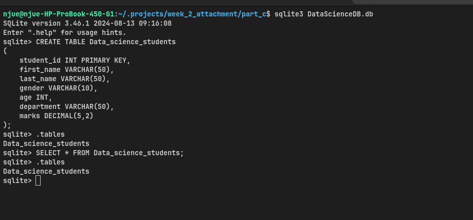

# Part C: Database Creation

## Database

For this task, SQLite was selected as the relational database management system because it is lightweight, requires no server installation, and stores the entire database in a single file.

The database created is named:

**DataScienceDB.db**

## Table Creation

The following SQL statement was used to create the `Data_science_students` table:

```sql
CREATE TABLE Data_science_students
(
    student_id INT PRIMARY KEY,
    first_name VARCHAR(50),
    last_name VARCHAR(50),
    gender VARCHAR(10),
    age INT,
    department VARCHAR(50),
    marks DECIMAL(5,2)
);
```

The table was successfully created in the SQLite database.

## Verification

